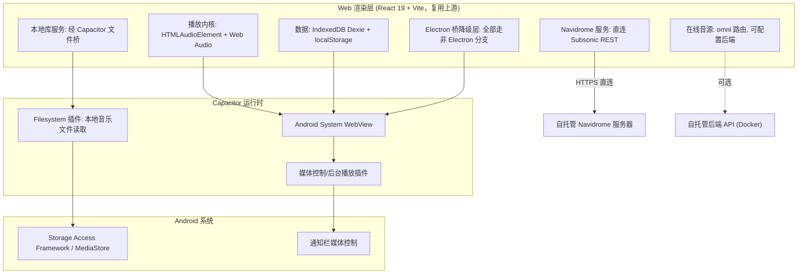

# Folia Android App

Feature Name: folia-android-app
Updated: 2026-09-04

## Description

将 Folia（folia-major）从 Electron 桌面应用改造为 Android 原生 App。采用 Capacitor 作为原生壳，复用现有 React 19 + Vite 渲染层代码，裁剪 Electron 主进程专属能力，聚焦 Navidrome 与本地库两个纯客户端音源，实现横竖屏自适应与触屏流畅交互，并保留在线音源的可配置后端接入点。

## Architecture

## 关键设计决策

1. **Capacitor 壳 + 复用渲染层**：保留 `src/` 全部渲染层逻辑，仅裁剪桌面专属分支，新增少量 Capacitor 适配层，避免重写 768 个源文件。
2. **Electron 桥降级**：`src/App.tsx:121` 已有 `isElectronWindow = Boolean(window.electron)` 判定，`window.electron` 在 Capacitor 环境为 `undefined`，绝大多数桌面能力已具备降级分支；需要逐一验证并补齐缺失的降级路径。
3. **本地文件导入替换**：`src/services/localMusicService.ts:173` 的 `window.showDirectoryPicker()` 在 Android WebView 不可用，替换为 Capacitor Filesystem 插件 + 系统文件选择器（SAF）。
4. **在线音源仅预留**：`src/services/onlineMusic/omni.ts` 保留，但首期通过配置开关隐藏在线 provider 入口，后端地址经环境变量注入，未来复用 `deploy/docker/` 的 compose 方案。

## Components and Interfaces

### 1. Capacitor 原生壳

- 工程结构：新增 `android/`（Capacitor 生成）与 `capacitor.config.ts`。
- 依赖插件：
  - `@capacitor/core` + `@capacitor/android`（运行时）
  - `@capacitor/filesystem`（本地音乐文件读取，替代 `showDirectoryPicker`）
  - `@capacitor/status-bar`（沉浸式/全屏状态栏控制）
  - 后台播放与媒体控制：`@capacitor-community/keep-awake` 或原生媒体会话封装（需在 Android 侧注册 `MediaSessionCompat`）。

### 2. Electron 桥降级层

- 入口：`src/App.tsx:121` `isElectronWindow` 判定。
- 需裁剪的组件/分支：
  - `src/components/WindowControls.tsx`、`src/components/TitlebarDragZone.tsx`（无 Electron 时 `return null`，已有部分处理）。
  - `src/components/app/AppShell.tsx:46-146` 自绘标题栏与拖拽区。
  - 快捷键监听 `src/hooks/usePlaybackInteractionBridge.ts:208-354`、命令面板 `src/components/command-palette/CommandPalette.tsx`。
  - 文件拖拽 `src/mods/ModsPanelTab.tsx:265-373`、`src/components/visualizer/tempera/TemperaImageLayerDialog.tsx`。
  - OBS `src/components/obs/`、遥控 `src/components/remote/`、mods `src/mods/`。
- 采用统一的环境判定 hook（如 `usePlatformCapabilities`）替代散落的 UA 判断，返回 `{ isNative, isDesktop, isTouch }`。

### 3. 本地音乐库适配

- 现有：`src/services/localMusicService.ts`（目录扫描）、`src/workers/metadataParser.worker.ts:154`（`parseBlob` 元数据解析，可复用）。
- 改造：新增 `src/services/capacitor/` 适配层，封装文件选择（SAF）、文件读取为 blob、持久 URI 授权。`localLibraryAvailability.ts` 的守卫逻辑改为优先走 Capacitor 文件桥。

### 4. Navidrome（无需改动）

- `src/services/navidromeService.ts` 已是纯 HTTP 客户端，`hashPassword` 现算 md5 token（`buildAuthParamsWithSalt`），直连 `rest/` 接口，天然适配移动端。仅需验证 Android WebView 的 CORS/网络行为。

### 5. 横竖屏与响应式

- 新增方向监听：通过 `window.matchMedia('(orientation: portrait)')` 或 Capacitor 的 `ScreenOrientation` 感知方向变化。
- 方向变化时重新初始化依赖 `innerWidth/innerHeight` 的画布（`src/components/Grid3D.tsx`、`GridView.tsx`、各 visualizer），保持播放状态。
- 引入移动端布局断点，补齐 `SettingsModal.tsx`、`FloatingPlayerControls.tsx` 等浮层的触屏布局。

## Data Models

| 数据 | 存储 | 说明 |
|------|------|------|
| Navidrome 配置（serverUrl/username/密码） | localStorage（键 `navidrome_config`） | 沿用现有，考虑迁移至 Capacitor Preferences 加密存储 |
| 本地曲库元数据 | IndexedDB（Dexie，`services/db.ts`） | 沿用 |
| 封面/二进制缓存 | 现有 OPFS（`localCoverBinaryStore.ts`） | 需实测 Android WebView OPFS 支持，必要时降级到 IndexedDB blob |
| 播放状态/偏好 | 现有 localStorage | 沿用 |
| 在线音源后端地址 | 环境变量（构建时注入） | 首期不暴露 UI 入口 |

## Correctness Properties

1. 在无 `window.electron` 环境下，应用 SHALL 不访问任何 Electron 专属 API（`preload.cjs` 全量能力被裁剪后不产生运行期异常）。
2. 播放内核 SHALL 仅依赖 `HTMLAudioElement` 与 Web Audio API，不依赖 Node 原生模块。
3. 本地文件读取 SHALL 始终经过 Capacitor Filesystem 插件，不调用 `showDirectoryPicker`。
4. 方向切换 SHALL 不丢失当前播放状态（曲目、进度、播放/暂停）。
5. 在线 provider 入口在未配置后端地址时 SHALL 隐藏。

## Error Handling

- Navidrome 连接失败：捕获 `ping` 异常，展示可读错误（服务器地址不可达 / 凭据错误）。
- 文件授权拒绝：保持当前曲库，Toast 提示授权被拒。
- WebView 能力缺失：`setSinkId`、OPFS、`showDirectoryPicker` 等均有特性守卫，缺失时隐藏 UI 或降级。
- 后台播放被系统回收：监听 Capacitor 生命周期，播放失败时恢复并提示。

## Test Strategy

- 单元测试：沿用 `vitest`（`npm run test`），覆盖环境判定 hook、降级分支、方向监听逻辑。
- 组件/快照：`playwright`（`npm run test:ui`），重点回归移动端断点布局与 Electron 分支裁剪后渲染。
- 真机/模拟器验证：Android Studio 模拟器 + 真机验证横竖屏、后台播放、SAF 文件导入、Navidrome 播放。
- 构建验证：`npm run build` 生成 Web 产物后 `npx cap sync android` 同步并 `gradle assembleDebug` 产出 APK。

## References

[^1]: (folia-major) - [上游仓库](https://github.com/ttao159/folia-major)
[^2]: (src/App.tsx#L121) - Electron 窗口判定入口
[^3]: (src/App.tsx#L285) - 播放内核 audioRef
[^4]: (electron/preload.cjs) - Electron 桥全量能力清单
[^5]: (src/services/localMusicService.ts#L173) - 目录选择器 showDirectoryPicker
[^6]: (src/services/navidromeService.ts) - Navidrome 客户端登录与播放
[^7]: (src/services/onlineMusic/omni.ts) - 在线音源统一路由
[^8]: (src/components/WindowControls.tsx) - 桌面窗口控制组件
[^9]: (src/hooks/usePlaybackInteractionBridge.ts#L208) - 桌面快捷键监听
[^10]: (deploy/docker/compose.yaml) - 在线音源后端 Docker 部署方案
